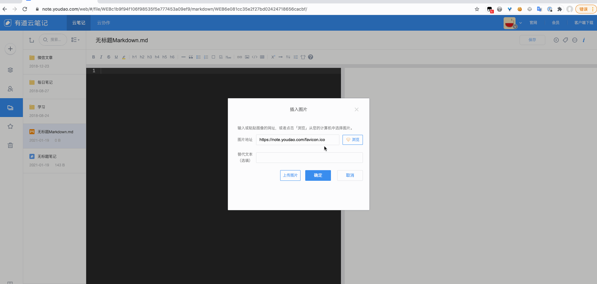

## 背景

先看一下目前的效果：在「Markdown 笔记」原有的上传图片弹窗中增加了一个我们自定义的上传按钮，通过直接与后端 API 交互完成图片上传（相关 API 是「笔记」上传时公开使用的）。



两年前还没开始使用 GitHub 记录读书笔记，那时在用有道云笔记。我使用的是 「Markdown 笔记」，在最开始一段时间没有上传图片的需求，所以用起来还可以。后来开始记录《Head First 设计模式》的读书笔记，并画了每个模式的类图，开始有了上传图片的需求，而官方将 「Markdown 笔记」上传图片的功能仅对会员开放。

穷则思变，机智的我就注意到了以前使用「笔记」时可以直接上传图片，并且没有会员限制，将这个图片的链接放到「Markdown 笔记」内也可正常使用。所以就先人工操作，每次需要上传图片时，先切到一个自己建立的用于上传图片的「笔记」，图片上传成功后再将链接拷贝回「Markdown 笔记」，暂时解决了上传图片的需求。

懒是第一生产力，做程序员最大的好处就是可以通过写代码简化日常网上活动的各种重复性操作。在按照前面的方式完成几篇带图片的「Markdown 笔记」后，就开始感到厌烦，这一操作机械重复没有任何价值，所以就想到很适合通过代码自动执行。

## 实现流程

由于我们需要的图片上传功能在「Markdown 笔记」页面中没有，所以不能使用操作页面元素的方式，只能通过抓 API ，并且自己调用 API 来实现图片上传。

### 封装 API

封装 API 前我们需要抓 API ，这个很简单，其实就是触发一下我们所需要实现的功能，然后查看浏览器发送了哪些请求，记住这些请求并封装一下，以便后续调用。


「笔记」图片上传操作后会发现浏览器发送了三个请求：
- 第一个是获取 `transmitId` 以供后续两个请求使用
- 第二个是使用 `transmitId` 上传图片（这里仅实现了小文件单次上传）
- 第三个是使用 `transmitId` 给上传完成的文件添加各种信息，并获取图片地址

一个简单的图片上传只需要三个请求，所以我们先封装一下，具体实现可以在 [api.js](src/api.js) 找到（其中还封装了其他 API ，不过后续没有使用到）

### 封装上传组件

点击完上传后，我们需要一个组件来实现选择图片、上传图片、返回图片地址这三个操作。我们在前面封装的 API 已经实现了上传图片并返回图片地址的功能，所以在这里我们这个组件只需要能触发选择图片逻辑即可。我们可以通过 `<input type="file">` 来实现选择文件的功能，然后我们需要对其注册 `change` 事件，用于当用户选择完图片后，实现后续的操作逻辑。

```javascript
// 上传文件，触发后，会选择文件，并执行上传文件获取url，最后执行回调（回调的第一个参数是文件，第二个参数是上传的url）
function upload(accept, callback) {
    // 1. 创建 input 节点
    if($('#diy-uploader-input').length == 0) {
        $('body').append('<input id="diy-uploader-input" type="file" style="position: absolute; top: -1000px; left: -1000px;" accept="' + accept + '">');
    }

    // 2. 并绑定点击事件，用于触发 实际执行上传
    var $this = this;
    $('#diy-uploader-input').on('change', function(event) {
        var file = event.target.files[0];
        var url = $this.doUpload(file);
        // 执行回调
        callback(file, url);
    });

    // 3. 执行模拟点击
    $('#diy-uploader-input').click();
}
```

### 封装上传功能

现在我们已经拥有了上传图片的能力，接下来就是要将这个能力添加到我们的「Markdown 笔记」中，我们需要支持两个功能：

- 在弹出上传的窗口中增加一个按钮，以便我们使用自定义的上传
- 上传成功后将相关信息回填到窗口中的对应字段

当时还没怎么接触过 `HTML` 和 `JavaScript` ，但这两个功能比较简单，编程的基本原理也没有使用新的知识体系，所以很快就能写出能完成功能的代码（~~省略中间处理各种问题的过程~~）。

```javascript
// 初始化，当md文件上传弹框出来的时候，添加上传图片按钮
function init() {
    // 有道云笔记用 on 绑定 DOMNodeInserted 不生效 - -|||
    $('body')[0].addEventListener("DOMNodeInserted", function(e){
        // 如果是 markdown 上传图片的节点被添加
        if(e.target.nodeName.toLowerCase()== 'markdown-upload-image') {
            var divButtonBarSelector = 'body > dialog-overlay > div > div > div.widget-dialog-body > markdown-upload-image > div > div.button-bar';

            // 如果 底部按钮栏已出来，并且没添加过 上传按钮，则添加 上传按钮
            if($(divButtonBarSelector).length == 1 && $('#diy-uploader-button').length == 0) {
                // 添加按钮
                var uploaderButton = '<div id="diy-uploader-button" class="loadbtn local-img" style="margin-right:15px;height:34px">上传图片</div>';
                $('body > dialog-overlay > div > div > div.widget-dialog-body > markdown-upload-image > div > div.button-bar').prepend(uploaderButton);

                // 给按钮添加事件
                $('#diy-uploader-button').on('click', function() {
                    component.uploader.upload('image/*', feature.mdImageUploader.backfillPage);
                });
            }
        }
    }, false);
}

// 回填页面
function backfillPage(file, url) {
    // 填入url
    var urlSelector = 'body > dialog-overlay > div > div > div.widget-dialog-body > markdown-upload-image > div > div:nth-child(2) > div.edit-container > input';
    $(urlSelector).val(url);
    // 触发 input 事件，更新双向绑定的数据
    tool.trigger(urlSelector, 'input');

    // 填入文件名
    var nameSelector = 'body > dialog-overlay > div > div > div.widget-dialog-body > markdown-upload-image > div > div:nth-child(3) > div.edit-container > input';
    var name = file.name.substring(0, file.name.lastIndexOf('.'));
    $(nameSelector).val(name);
    // 触发 input 事件，更新双向绑定的数据
    tool.trigger(nameSelector, 'input');
}
```

至此我们已经实现了有道云笔记支持「Markdown 笔记」上传图片的功能。可以直接将 [loader.js](src/loader.js) 中的代码拷贝至 Tampermonkey 中即可实现非会员上传。

## 小结

这一段脚本是两年前写的，但是至今仍旧可以使用。虽然时隔很久，脚本实现的具体细节早已忘记，但是当我看到我这丰富的注释时，还是可以回想起来当时想法及每段代码的逻辑。写注释也是我一直坚持的好习惯，平时写业务代码中没有这么详细的注释去解释每一行的操作逻辑，但仍旧会在每一段相对独立的操作开始时注明其功能等信息。
